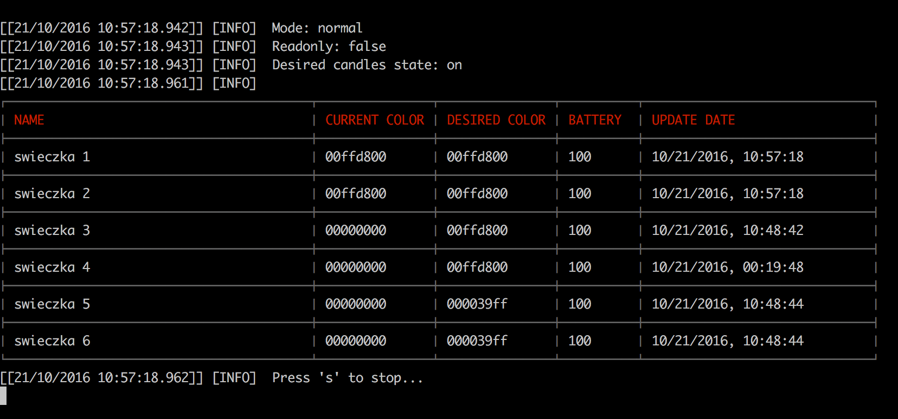

# Playbulb IFTTT

*Playbulb IFTTT* is a tool that can connect IFTTT (If This, Then That, [ifttt.com]()) to the Playbulb Candles ([http://www.playbulb.com]()).

The main problem with this connection is that Playbulb Candles have only Bluetooth LE interface, and isn't directly connected to the internet, so whole integration requires dedicated computer that will connect IFTTT and turn on and off candles when necessary.



## Features

* toggle multiple Playbulb Candle devices basing of the IFTTT recipes
* manually turn on / off multiple Playbulb Candles
* auto discover new candles, and set their colour to prefiously selected default one
* set correct colors for each candle individually (each candle can use it's own colour)
* "readonly" mode, that reads current color of all nearby candles (useful when you set correct color using Playbulb's original mobile app, and you just wan't to read it's hex color)
* Track battery level of all candles, and save them to .csv file

##Getting started

###Prerequisites

**Playbulb IFTTT** requires:

* node.js
* npm
* all prerequsities for Noble library (https://github.com/sandeepmistry/noble), like bluetooth stack

**Playbulb IFTTT** was tested on MacOS 10.12 Sierra, and Ubuntu 16.04, but I guess that is should work also on other platforms that are supported by Noble (like eg. Windows)

###Installation & Configuration

1. Install all prerequsities from previous section
2. Install all npm requirements with `npm install`
3. Create correct **Google Spreadsheets** (more details below)
4. Create correct **IFTTT** recipes (more details below)
5. Download **Playbulb IFTTT** latest release
6. Configure **Playbulb IFTTT** script (more details below)
7. Launch the script!

#### IFTTT recipes

In oredr to use **Playbulb IFTTT** you have to create set of IFTTT recipes that will connect to one of the the google spreadsheets. 

These recipes should generate "0"s and "1" and add them to selected spreadsheets that will be read by the rest of the system.

#### Google Spreadsheets

As it was written before, IFTTT will generate Google spreadsheets with lists of "0"s and "1"s that needs to be translated to single sheet that will tell if candles needs to be turned on or off right now.

**Playbulb IFTTT** will require 2 spreadsheets:

* simple one that will be used directly by the IFTTT recipe (one with "0"s and "1"s
* secondary sheet that will parse first one and tell what is current state of candles

First sheet needs to be a empty one, that will be connected to IFTTT

In order to create second sheet, you can copy [this](https://docs.google.com/spreadsheets/d/1rO1rU3TQSLw0BdztcY7Jgg8DuVxbPpyWgsPDMOp7eV4/edit?usp=sharing). After copying the sheet you need to configure it in "settings" sheet, and insert  key of first spreadsheet.

#### Configuration

##### Google spreadsheets
In order to use **Playbulb IFTTT** you have to create configuration file that will contain key and sheet GID for second spreadsheet from previous section.
This configuration file is stored in `configuration/networkConfiguration.json`, and looks like this:

```
{
  "id": "networkConfiguration",
  "spreadsheetKey": "<key>",
  "spreadsheetColorsGID": "<gid>"
}
```

###### Default color

Besides of this you can set default color of candles that will be set to all new  candles that will be discovered by the script.
You can set this color by using this command:

```./playbulb setDefaultColor <color>```

for example:

```./playbulb setDefaultColor 00ff00ff```

##### Individual colors

You can also set different colors for every candles with this command

```./playbulb setColor <candleID> <color>```

for example setting color `00ff00ff` for candle with ID `b5208596e1814d90a73ec1ab813e014d`:

```./playbulb setColor b5208596e1814d90a73ec1ab813e014d 00ff00ff```

## Example

Idea for a system that will turn on my candles when sunrise would occur, and will be turned off at midnight:

At first create simple spreadsheet (at the beginning it will be empty of course):


Create IFFT reciepes for turning candles on and off:


Than I've copied [this](https://docs.google.com/spreadsheets/d/1rO1rU3TQSLw0BdztcY7Jgg8DuVxbPpyWgsPDMOp7eV4/edit?usp=sharing) spreadsheet, and configured it correctly:


Than, download **Playbulb IFTTT** and create `configuration/networkConfiguration.json` file with correct key and GID of an "Output" sheet:


```
{
  "id": "networkConfiguration",
  "spreadsheetKey": "891vazg8iCYJ3JXaEd9RhGoKv7KPkH7xW2MHLnkxmJsc",
  "spreadsheetColorsGID": "14322231205"
}
```

Than, configure your default color for new candles, for example:

```./playbulb setDefaultColor 00ff00ff```

And at the end lanuch the script in normal mode:

```./playbulb run normal```


## Usage

Available options:

```
  Usage: playbulb [options] [command]


  Commands:

    showConfiguration            Shows current configuration
    setDefaultColor <color>      Sets default color for newly discovered candles
    setColor <candleID> <color>  Updates target color for particular candle
    run <mode>                   starts normal execution. Available modes: normal / readonly / forceOn / forceOff

  Options:

    -h, --help     output usage information
    -V, --version  output the version number
```
    
### Run modes:

#### normal

This mode will use previously configured IFTTT reciepies and spreadsheets in order to toggle candles statuses

#### forceOn / foreceOff

In this mode script will turn on or off all candles that it can find

#### readonly

In this mode script will connect to all nearby candles, and only read their current colors. You can use this mode in order to find correct color for candles (color can be set for example using original Playbulb mobile app).     

## Tips

### Choosing correct BLE adapter

Sometimes when you run the script on the system with multiple Bluetooth adapters you may experience this error:

```
[[21/10/2016 15:14:28.199]] [LOG]   noble warning: adapter does not support Bluetooth Low Energy (BLE, Bluetooth Smart).
[[21/10/2016 15:14:28.213]] [LOG]                  Try to run with environment variable:
[[21/10/2016 15:14:28.217]] [LOG]                  [sudo] NOBLE_HCI_DEVICE_ID=x node ...
```

In order to fix this issue you need to select correct BLE adapter by setting `NOBLE_HCI_DEVICE_ID` variable at the beginning of the command, for example:

```
[sudo] NOBLE_HCI_DEVICE_ID=1 ./playbulb run normal
```

for adapter with number 1. You can view list of available adapters by using `hcitool dev` (Ubuntu).

## Thanks

Lists of candle's characteristics by:
[https://github.com/Phhere/Playbulb]()

##License
Playbulb IFTTT is released under a MIT License. See LICENSE file for details.
